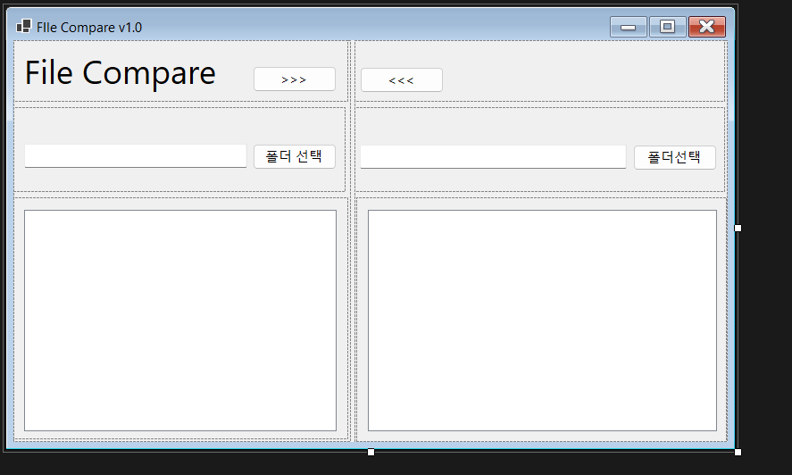

#(C# 코딩) FileCompare

## 개요
-C# 프로그래밍 학습
-1줄 소개: 
-사용한 플랫폼:
 -C#, .NET Windows Forms, Visual Studio, GitHub
-사용한 컨트롤:
 -Label, button, SplitContariner, Panel
-사용한 기술과 구현한 기능
 -Visual Studio를 이용하여 UI디자인
 -
## 실행 화면
 -코드의 실행 스크린샷과 구현 내용 설명 

 ## 과제 1 실행 화면

Label, button, SplitContariner, Panel를 사용하여 UI를 구현하였다. 
각각 Anchor를 사용하여 창을 늘리거나 Split을 사용할때 UI들이 늘어나거나 줄어들도록 만들었다.

## 과제 2 실행 화면

Label, button, SplitContariner, Panel를 사용하여 UI를 구현하였다. 
각각 Anchor를 사용하여 창을 늘리거나 Split을 사용할때 UI들이 늘어나거나 줄어들도록 만들었다.''

## 과제3 실행 화면

Label, button, SplitContariner, Panel를 사용하여 UI를 구현하였다. 
각각 Anchor를 사용하여 창을 늘리거나 Split을 사용할때 UI들이 늘어나거나 줄어들도록 만들었다.''

## 과제4 실행 화면

Label, button, SplitContariner, Panel를 사용하여 UI를 구현하였다. 
각각 Anchor를 사용하여 창을 늘리거나 Split을 사용할때 UI들이 늘어나거나 줄어들도록 만들었다.''

