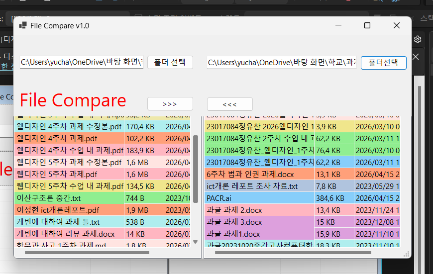
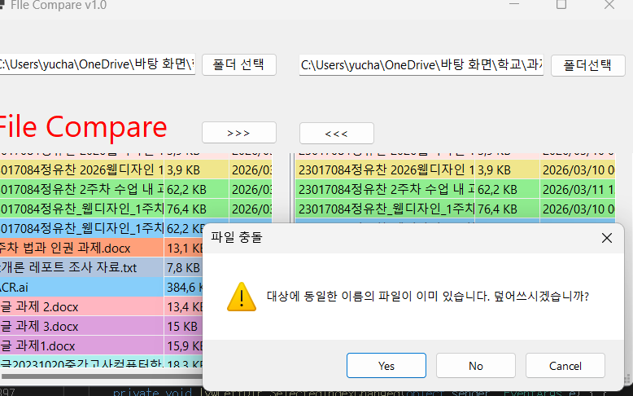
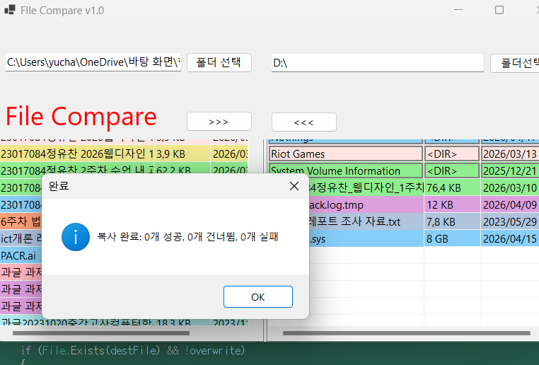
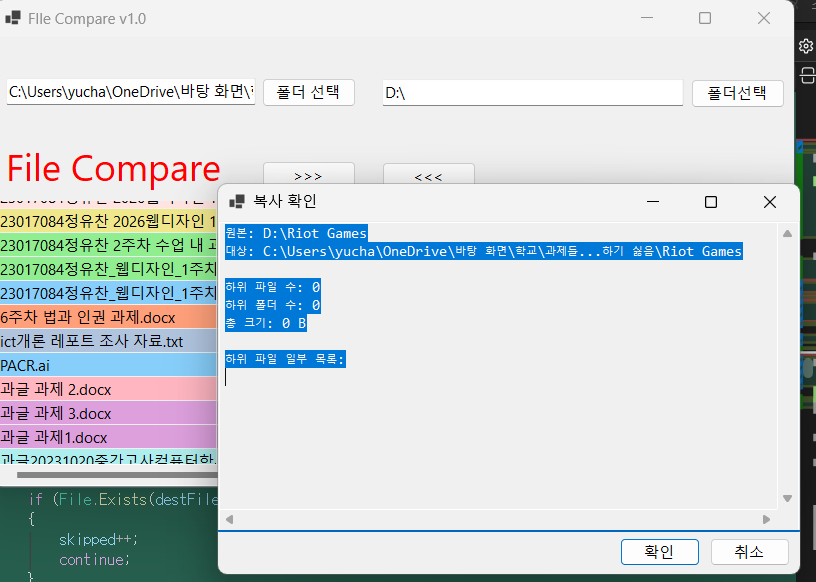

#(C# 코딩) FileCompare

## 개요
-C# 프로그래밍 학습
-1줄 소개: 폴더 안의 파일 비교와 복사
-사용한 플랫폼:
 -C#, .NET Windows Forms, Visual Studio, GitHub
-사용한 컨트롤:
 -Label, button, SplitContariner, Panel
-사용한 기술과 구현한 기능
 -Visual Studio를 이용하여 UI디자인
 -
## 실행 화면
 -코드의 실행 스크린샷과 구현 내용 설명 

 ## 과제 1 실행 화면

Label, button, SplitContariner, Panel를 사용하여 UI를 구현하였다. 
각각 Anchor를 사용하여 창을 늘리거나 Split을 사용할때 UI들이 늘어나거나 줄어들도록 만들었다.

## 과제 2 실행 화면

폴더 선택 기능과 파일 리스트 기능 구현을 하였다. 파일마다 색상이 구분 가도록 만들었다.

## 과제3 실행 화면

양쪽 폴더 사이에서 파일의 복사 기능을 만들었다. 선택한 파일을 반대쪽 폴더로 복사하기를 할 수 있도록 만들었고 동일한
파일이 있다면 덮어쓰시겠습니까? 라는 창이 뜨도록 만들었다.

## 과제4 실행 화면

하위 폴더를 하나의 파일 처럼 처리하였다. 적절하게 색상을 표시하였고 복사 버튼을 누르면 하위 폴더의 모든 내용을 보여주고 확인 후 
복사 되도록 만들었다.

